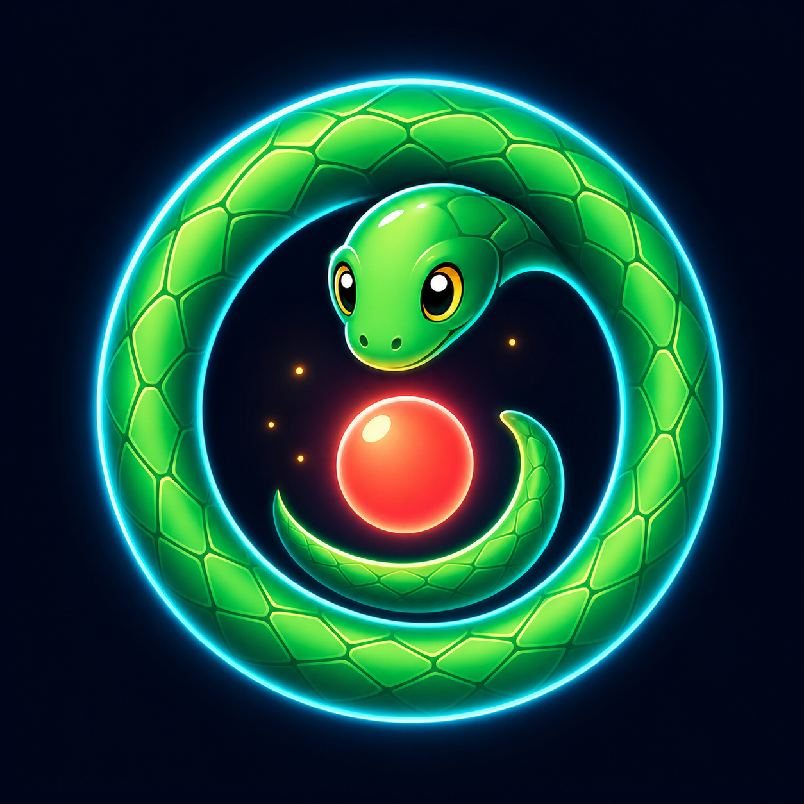
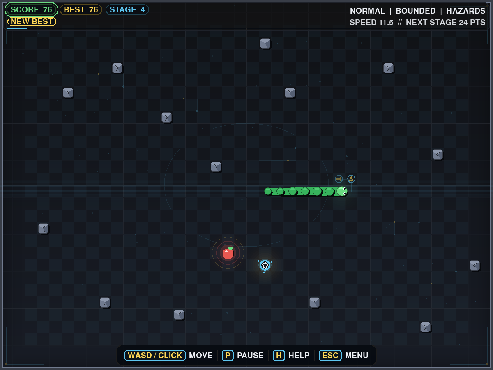

# Snake Arcade

<p align="center">
  
</p>

A complete, modern Snake game focused on responsive controls, readable visuals, meaningful progression, and replayable arcade runs.

<p align="center">
  
</p>

Version **1.6.3** is a self-contained desktop game with persistent settings, career progress, achievements, per-mode leaderboards, mouse controls, and a polished audiovisual presentation.

## What You Get

- Classic Snake core loop with smooth grid-step movement.
- Multiple run styles:
  - Difficulty presets (`Easy`, `Normal`, `Hard`)
  - Map modes (`Bounded`, `Wrap`)
  - Optional obstacles that expand as stages advance
- Power-ups with real gameplay impact:
  - `Shield`: absorbs one fatal collision
  - `Phase`: pass through obstacles and wrap through walls
  - `Slow Time`: temporary speed slowdown
  - `Double Score`: temporary score multiplier
- Persistent data in `data/save.json`:
  - Settings
  - Graphics preferences
  - Leaderboards for every difficulty/map/obstacle combination
  - Career stats and five achievements
- UI/graphics features:
  - Theme switching (`Neon`, `Sunset`, `Ocean`)
  - Color modes (`off`, `deuteranopia`, `tritanopia`, `high_contrast`)
  - Adjustable text size, grid, particles, reduced motion, and screen shake
  - Distinct power-up symbols and visible active-effect auras
  - Smooth interpolated snake motion with rounded, tapered segments
  - Atmospheric checkerboard arenas, colored lighting, and mode-specific boundaries
  - Animated arena energy, stage-reactive circuitry, danger warnings, and fading motion trails
  - Live speed, danger, and next-stage telemetry in a compact arcade HUD
  - Faceted rock hazards, beacon-highlighted food, orbiting pickups, and stage-progress lighting
  - Floating score feedback and cinematic stage-advance transitions
  - Click-steering target feedback and a grouped, responsive control dock
  - Buffered-turn intent arrows, animated score pulses, and new-best celebrations
  - A cinematic radial countdown and expanding `GO!` start cue
  - Layered scene backgrounds, redesigned HUD, branded window icon, and fullscreen mode
  - Reusable help overlay, click-to-steer, auto-pause, and richer arcade sound cues
  - Progress screen and enhanced game-over summary

## Quick Start

### Requirements

- Python `3.12+`
- `uv`
- A display resolution of at least `800x600`

### Install

```bash
uv sync --group dev
```

### Run

```bash
uv run python main.py
```

You can also launch the package entry point:

```bash
uv run snake-game
uv run python -m snake_game
```

Useful runtime options:

```bash
uv run snake-game --data-file data/dev-save.json --seed 42 --no-countdown
uv run snake-game --width 1000 --height 700 --cell-size 20 --obstacle-count 20
```

### Test

```bash
uv run python -m pytest
```

### Quality and Release Checks

Run the same checks used by continuous integration:

```bash
uv lock --check
uv run ruff check .
uv run ruff format --check .
uv run python -m pytest --cov=snake_game --cov-report=term-missing
uv build
uv run --frozen twine check dist/*
uv run --isolated --no-project --with ./dist/*.whl snake-game --version
```

The test suite enforces at least 75% branch coverage. The release checks verify the lockfile, build both distribution formats, validate their metadata, and run the installed wheel. `uv build` creates an installable wheel and source archive in `dist/`.

## Controls

| Context | Keys | Action |
|---|---|---|
| Menus | `Up/Down` or `W/S` | Navigate |
| Menus | `Left/Right` or `A/D` | Change value |
| Menus | `Enter` or `Space` | Select |
| Menus | `Esc` | Back / Exit |
| In game | `Arrow Keys` or `WASD` | Move |
| In game | `P` or `Space` | Pause / Resume |
| In game | `Esc` | Return to menu |
| Anywhere | `M` | Mute / unmute sound |
| Anywhere | `F11` | Toggle fullscreen |

The game also supports mouse navigation in menus and click-to-steer during a run. Losing window focus automatically pauses active gameplay.

## How a Run Progresses

- Eat food to grow, score, and speed up.
- Every 25 points advances the stage.
- When obstacles are enabled, each stage adds new hazards away from the snake, food, and active power-ups.
- Power-ups can absorb a collision, slow time, double score, or phase through walls and obstacles.
- Each completed run updates the matching leaderboard, career totals, and achievement progress.

## Persistence Notes

- Save path: `data/save.json`
- Writes use an atomic temporary-file replacement so an interrupted save cannot leave a partially written file.
- Older save schemas migrate automatically.
- Corrupt saves are moved beside the original with a `.corrupt-<timestamp>` suffix before safe defaults are loaded.
- Unreadable, excessively nested, and oversized saves are treated as corrupt; saves larger than 1 MiB are not loaded.
- Saves from a newer, unsupported game version are preserved with an `.unsupported-<timestamp>` suffix instead of being overwritten.
- If a write fails because the folder is unavailable or read-only, the game keeps running and displays a persistent warning.

## Troubleshooting

- **The game rejects a custom window size:** both dimensions must be at least `800x600` and divisible by `--cell-size`.
- **Audio is unavailable:** the game continues silently when no compatible audio device is present.
- **Settings or progress will not save:** confirm that `--data-file` names a file and its parent folder is writable.
- **You want a fresh profile:** close the game, then rename or remove `data/save.json`. A new profile is created on the next launch.
- **A headless machine cannot open a window:** use the dummy SDL video and audio drivers, as configured in `.github/workflows/ci.yml`.
